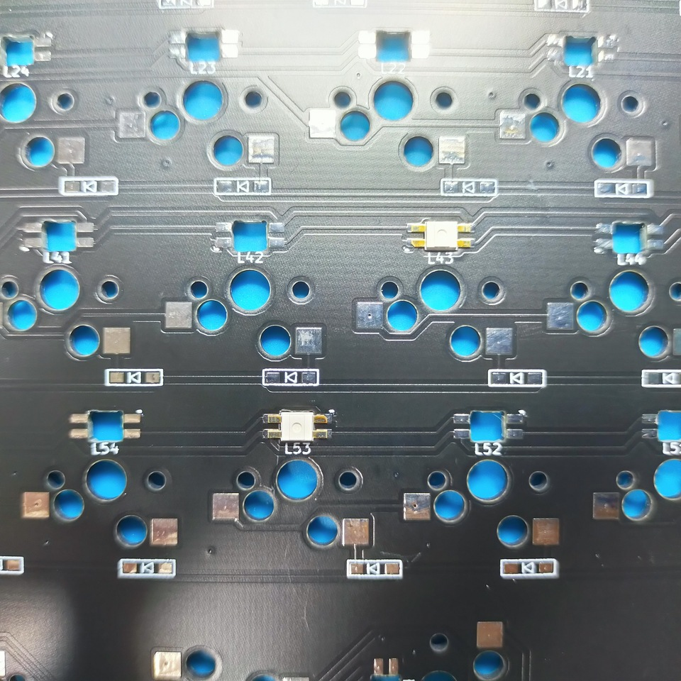
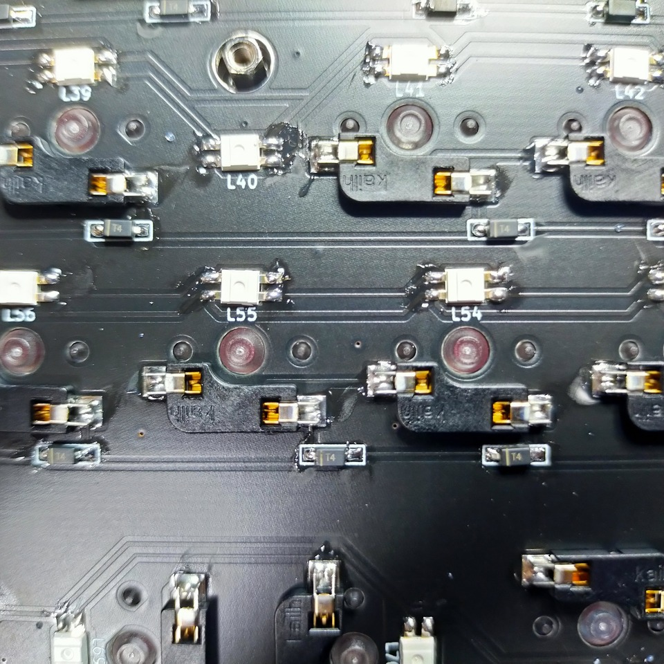
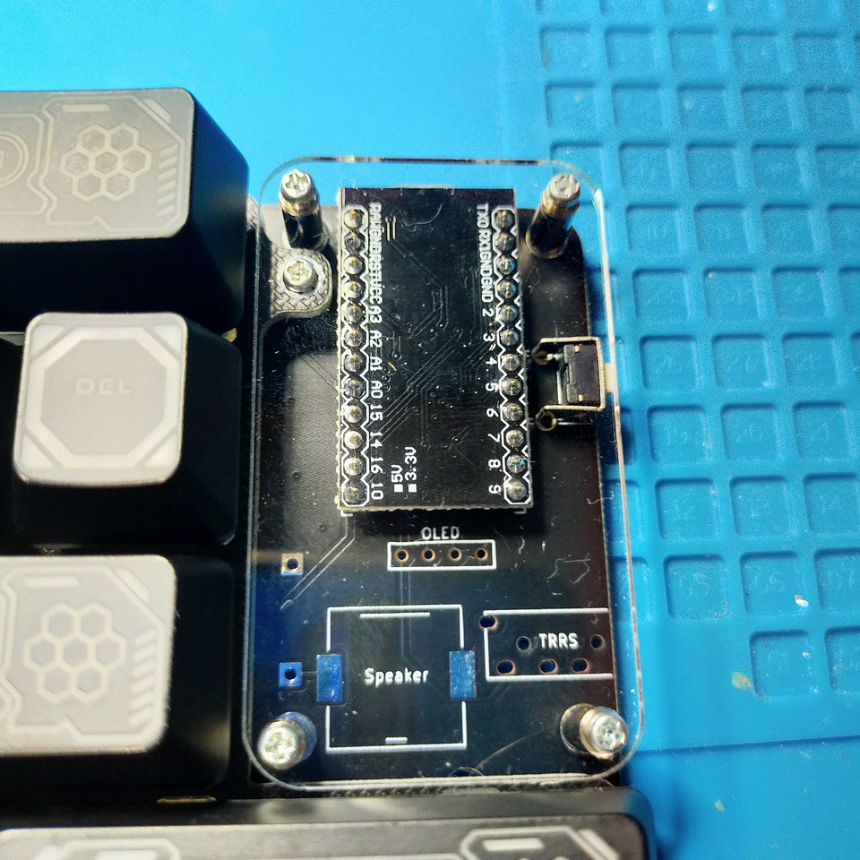
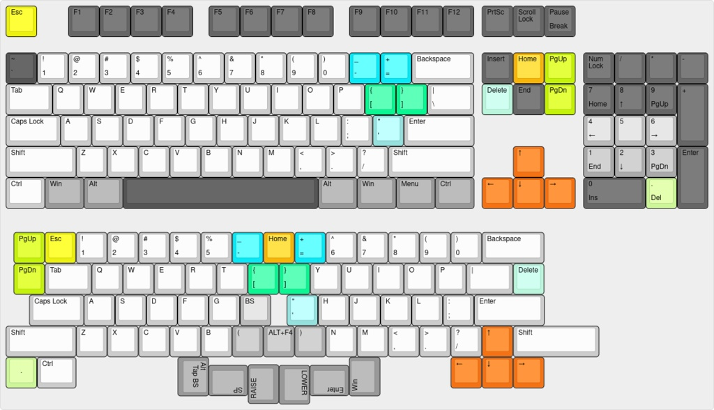
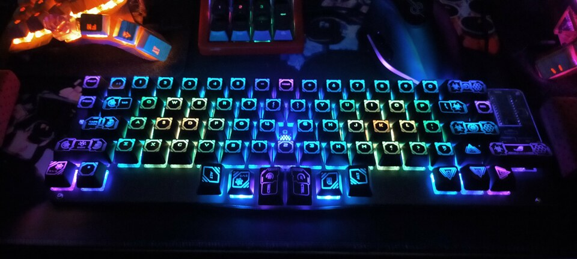

# Amatelus73ビルドガイド

## 概要

m.teiさんの[セミエルゴレイアウト](https://github.com/mtei/SemiErgo_Layout)を参考に作成したシンメトリカルスタッガードキーボード。  
RGBMATRIXに標準対応しているのも特徴。


### 材料リスト

| 品目                    | 数量 | 備考 |
| :---------------------- | ---: | :--- |
| PCB                     |  1枚 |  |
| トッププレート          |  1枚 |  |
| ボトムプレート          |  1枚 |  |
| アクリル保護プレート    |  2枚 |  |
| ProMicro                |  2個 |  |
| ダイオード              | 73個 | スピーカーを使う場合74個。<br>スルーホールは使えないので注意。 |
| LED(YS-SK6812mini)      | 74個 | 保護プレートを光らせる場合52個。 |
| Kailhソケット           | 73個 |  |
| M2L4ネジ                | 18本 |  |
| M2L7六角スペーサ        |  5本 |  |
| M2L8丸スペーサ          |  4本 |  |
| タクトスイッチ          |  1個 |  |
| ゴム足                  |  4個 |  |
| MX互換スイッチ          | 73個 |  |
| キーキャップ            | 73個 |  |
| USBケーブル             |  1本 |  |

### オプション機能

| 品目             | 数量 | 備考 |
| :--------------- | ---: | :--- |
| コンスルー       |  2本 |  |
| 圧電サウンダ     |  1個 | スピーカーオプション<br>型番: PKMCS1212E4000-R1 |
| 1kΩ抵抗         |  1個 | スピーカーオプション |
| OLED             |  1個 | ピン、ソケットも。 |


## 組み立て手順

### LED

LEDをはんだ付けします。  
小さくドットが入っているのが欠けている足に対応しています。

行ごと向きが違うので注意してください。



### ダイオード

ダイオードをはんだ付けします。  
向きに気をつけてください。  
うっすら線が書いてあるほうが左です。

先に予備ハンダとしてどちらかのパッドにハンダを盛って、
予備ハンダを溶かすようにしてダイオードの片足をはんだ付けします。  
この状態で横から見てダイオードが浮いていないことを確認してください。  
浮いてしまっている場合はダイオードをピンセットで押さえつけながら、
はんだづけした部分を再度熱すればきれいになります。

浮いていないことを確認し、反対側をはんだ付けします。




### ソケット

ソケットをはんだ付けします。


### リセットスイッチ

反対側(表、スイッチ側)にひっくり返して、
タクトスイッチを差し込み、
再度裏面に戻してはんだ付けします。


### 圧電サウンダ(オプション)

1kΩ抵抗、ダイオード、圧電サウンダをはんだ付けします。


### ProMicro

ここだけは間違えるとリカバリが面倒なので、**細心の注意**をして作業にあたってください  
コンスルーを使う場合は[Helixのビルドガイド](https://github.com/MakotoKurauchi/helix/blob/master/Doc/buildguide_jp.md#pro-micro)などを参考にしてください。  
また、ProMicroはあらかじめいわゆる「モゲ対策」をしておくといいです。


まず4角のピンをはんだ付けし、
ピンヘッダとプロマイクロが浮いていないことを確認して、
他のピンをはんだ付けします。  
浮いてしまっていた場合、やけどに気を付けて、指で少し抑えながら、
浮いているピンにハンダをあてます。
裏面に戻し、表面と同様に4角からはんだ付けしていきます。



この段階で一度後述のLEDテスト用のファームウェアの書き込みをして導通テストしておくといいです。  
問題なければ全LEDが点灯するはずです。  
(RGB_MATRIXはキー押下に応じてLEDが光るモードがデフォルトになっているようなのでLED_testで確認するのが吉です。)

```sh
git clone https://github.com/swanmatch/qmk_firmware.git --recursive
cd qmk_firmware
make amatelus73:led_test:avrdude
```


### OLED(オプション)

OLEDにピンをはんだ付けし、基板側にソケットをはんだ付けします。
いずれも斜めになりやすいので注意してください。


### プロマイクロ保護プレート

PCB裏側から丸スペーサーをネジ止めして、
表側に保護プレートを挟み込む形でPCネジで止めます。

### スタビライザ

スタビライザを組み立てて、回路基板にはめ込みます。  

### スイッチ

トッププレートにスイッチをはめて、PCBに刺します。  
これも最初に4角からはめるといいです。


### プレート

ボトムプレートに六角スペーサーをネジ止めして、
本体にはめ込み、ネジ止めします。

ボトムプレートにゴム足を貼り付けてください。


### ファームウェア

ファームウェアの書き込みは以下のコマンドを叩きます。  
QMKの環境構築についてはお使いのOSによって異なりなりますので、
公式ドキュメントを読んでください。
```sh
# LEDテストの書き込みを実施した場合は↓は不要
git clone https://github.com/swanmatch/qmk_firmware.git --recursive
cd qmk_firmware
make amatelus73:default:avrdude
```

### キーキャップ

キーキャップの取り付けは下記を推奨しています。  
図はm.teiさんに作成いただきました。

Special Thanks!!




## 完成図

